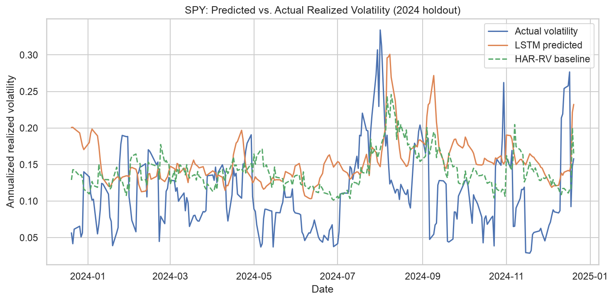

# Stock Volatility Predictor

Forecasting short-horizon stock return volatility with an LSTM/Transformer model, benchmarked against HAR-RV — the standard econometric baseline used in volatility research — rather than a naive baseline.

## Why this exists

Most volatility-forecasting projects stop at "beat a naive model." This one is built to hold up to the standard actually used in quant research: comparison against HAR-RV, evaluation with the loss functions practitioners use (QLIKE, not just MSE), and walk-forward validation so the model never trains on future information.

## Results

| Model      | QLIKE | Mincer-Zarnowitz R² |
|------------|-------|----------------------|
| HAR-RV (baseline) | [x.xx] | [x.xx] |
| LSTM/Transformer  | [x.xx] | [x.xx] |

*(Fill in your real numbers here — this table is what a reviewer looks at first.)*


*(Add a plot image here — predicted vs. realized volatility over the test window.)*

## Approach

- **Data:** Historical OHLCV data via Yahoo Finance
- **Target:** Realized volatility over a forward window
- **Baseline:** HAR-RV (Heterogeneous Autoregressive Realized Volatility model)
- **Model:** LSTM / Transformer (TensorFlow)
- **Evaluation:** QLIKE loss and Mincer-Zarnowitz R² under walk-forward validation (no look-ahead bias)

## Project structure

```
src/            core data pipeline, model, and evaluation code
notebooks/      exploratory analysis and result visualization
configs/        model and experiment configuration
tests/          unit tests for the pipeline
```

## Running it

```bash
pip install -r requirements.txt
python src/train.py --config configs/default.yaml
```

*(Adjust the command above to match however your entry point actually works.)*

## Notes

Built with an agentic development workflow (Claude Code) for scaffolding and iteration — see `agent_docs/` for the project spec and evaluation framework this was built against.
